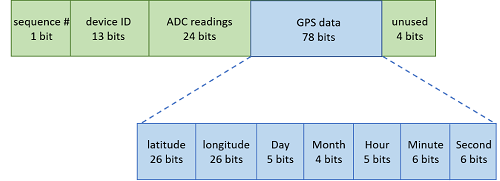

# Solar-Powered Fleet Tracking System
A self-powered GPS tracking system ideal for deployment in rural areas. It attaches to any sun-exposed vehicle and relays the vehicle’s GPS location (latitude and longitude) in real-time to a central node, which displays the location on an interactive map. The project involves a star network of two roaming nodes that communicate with a central home node. The roaming nodes are self-powered by solar energy and communicate through LoRa (long range) modulation. A media access control (MAC) protocol that uses channel activity detection (CAD) and exponential back-off ensures that all nodes communicate without interference. This project joins many other self-powered Internet of Things (IoT) applications at the forefront of recent research and commercial products.  
## System Overview
The system diagram of two roaming nodes transmitting to a central node:

The bload diagram of the system is shown below:

Three PCBs were made, two for the roaming nodes and one home node. The roaming node could be reconfigured to be a home node. The roaming node layout is seen below.

The enlarged RF section is shown here:

The final populated PCB is shown here:

The paload was constructed as follows:

The LoRa communication protocol added the following wrapper for authentication and data integrity:

On the software side, the code was modularized as follows:

The final UI is shown here:

